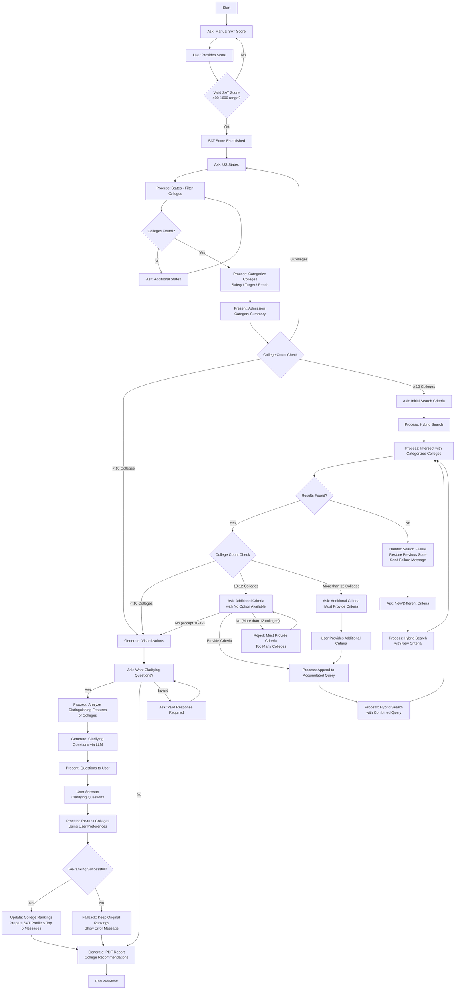

# College Chatbot 🎓🤖

An intelligent college admissions assistant that provides personalized college recommendations based on SAT scores, geographic preferences, and individual student needs.

## Overview

The College Chatbot is a Chainlit-powered web application that helps students navigate the college application process through an interactive, AI-driven workflow. It analyzes student profiles, categorizes colleges by admission probability, and provides detailed recommendations with downloadable reports.

### Key Features

- 🎯 **SAT-Based Matching**: Personalized recommendations using your SAT score (400-1600)
- 🗺️ **Geographic Filtering**: Filter colleges by preferred US states
- 📊 **Risk Categorization**: Automatic classification into Safety/Target/Reach schools
- 🔍 **Advanced Search**: Semantic search with natural language queries
- ❓ **Clarifying Questions**: AI-generated personalized preference discovery
- 📈 **Interactive Visualizations**: Comprehensive college analysis and comparisons
- 📄 **PDF Reports**: Downloadable college recommendation summaries

## Quick Start

### Prerequisites

1. **Install Docker**
   - [Windows](https://docs.docker.com/desktop/install/windows-install/)
   - [macOS](https://docs.docker.com/desktop/install/mac-install/)
   - [Linux](https://docs.docker.com/engine/install/)

2. **Get OpenRouter API Key**
   - Sign up at [OpenRouter](https://openrouter.ai/)

### Easy Deployment

1. **Clone the repository:**
   ```bash
   git clone https://github.com/shermanpch/college-chatbot.git
   cd college-chatbot
   ```

2. **Set up environment:**
   ```bash
   cp example.env .env
   # Edit .env with your API key and model:
   # OPENROUTER_API_KEY=your_api_key_here
   # OPENROUTER_SELF_RETRIEVAL_MODEL=openai/gpt-4o-mini
   ```

3. **Deploy:**
   
   **Windows (PowerShell):**
   ```powershell
   .\deploy.ps1
   ```
   
   **macOS/Linux:**
   ```bash
   ./deploy.sh
   ```

4. **Access the application:**
   Open your browser to `http://localhost:8000`

## Configuration

### Environment Variables

The application uses a `.env` file for configuration. Copy `example.env` to `.env` and configure:

**Required Variables:**
```bash
# OpenRouter API Configuration (Required)
OPENROUTER_API_KEY=your_openrouter_api_key_here
OPENROUTER_SELF_RETRIEVAL_MODEL=openai/gpt-4o-mini
```

**Optional Configuration:**
```bash
# Additional models for specific components
OPENROUTER_MODEL=openai/gpt-4o-mini
OPENROUTER_RAGAS_MODEL=openai/gpt-4o-mini

# Application settings
PORT=8000
HOST=localhost
LOG_LEVEL=INFO

# External services (optional)
FIRECRAWL_API_KEY=your_firecrawl_api_key_here

# System settings (automatically set)
ANONYMIZED_TELEMETRY=False
TOKENIZERS_PARALLELISM=False
```

## Container Management

### Using Deployment Scripts

**Windows (PowerShell):**
```powershell
.\deploy.ps1                   # Deploy application
.\deploy.ps1 -Logs             # View container logs
.\deploy.ps1 -Status           # Check container status
.\deploy.ps1 -Stop             # Stop container
.\deploy.ps1 -Help             # See all options
```

**macOS/Linux:**
```bash
./deploy.sh                    # Deploy application
./deploy.sh --logs             # View container logs
./deploy.sh --status           # Check container status
./deploy.sh --stop             # Stop container
./deploy.sh --help             # See all options
```

### Manual Container Commands

```bash
# View logs
docker logs college-chatbot-container

# Stop/start container
docker stop college-chatbot-container
docker start college-chatbot-container

# Remove container
docker stop college-chatbot-container
docker rm college-chatbot-container
```

## Testing the Application

1. **Application Load Test**
   - Access `http://localhost:8000`
   - Verify Chainlit interface loads
   - Check College Chatbot branding

2. **Feature Testing**
   - SAT Score Input (400-1600 range)
   - State Selection for filtering
   - College categorization (Safety/Target/Reach)
   - Hybrid search functionality
   - Clarifying questions workflow
   - PDF report generation

3. **Monitor Logs**
   ```bash
   docker logs -f college-chatbot-container
   ```

## Production Deployment

### Prerequisites

1. **Linux Server**: Ubuntu 20.04+ or Debian 10+ recommended
2. **Domain Name**: A registered domain pointing to your server's IP address
3. **Root Access**: Sudo privileges on your server

### Quick Production Setup

1. **Configure DNS** - Point your domain to your server:
   - `your-domain.com` → your_server_ip
   - `www.your-domain.com` → your_server_ip

2. **Deploy with SSL:**
   ```bash
   # Set up environment
   cp example.env .env
   # Edit .env with:
   # OPENROUTER_API_KEY=your_api_key
   # OPENROUTER_SELF_RETRIEVAL_MODEL=openai/gpt-4o-mini
   # DOMAIN=your-domain.com
   # SSL_EMAIL=your-email@example.com

   # Deploy with automatic SSL setup
   ./deploy.sh --deploy-with-proxy
   ```

3. **Access:** `https://your-domain.com`

**Windows users:** Use `.\deploy.ps1 -DeployWithProxy` for setup information, but deploy on a Linux server for production.

### Production Features

- **SSL/HTTPS**: Free certificates from Let's Encrypt
- **Auto-renewal**: Certificates renew automatically
- **Security Headers**: Protection against web attacks
- **WebSocket Support**: Real-time Chainlit features
- **Health Monitoring**: Built-in endpoint at `/health`

## Development Setup

### Local Development (Alternative to Docker)

1. **Clone and setup:**
   ```bash
   git clone https://github.com/shermanpch/college-chatbot.git
   cd college-chatbot
   python -m venv .venv
   source .venv/bin/activate  # On Windows: .venv\Scripts\activate
   pip install -e .
   ```

2. **Configure environment:**
   ```bash
   cp example.env .env
   # Edit .env with your API key and model
   ```

3. **Run locally:**
   ```bash
   chainlit run chatbot/app.py
   ```

### Code Quality

**Install development tools:**
```bash
pip install -e ".[dev]"
pre-commit install
```

**Run linting:**
```bash
pre-commit run --all-files
```

## How It Works

The chatbot follows a structured workflow to provide personalized college recommendations:

### Workflow Steps

1. **SAT Score Input** - Enter your SAT score for admission probability calculations
2. **Geographic Filtering** - Select preferred US states for college search
3. **College Categorization** - Automatic classification into Safety/Target/Reach schools
4. **Smart Search & Refinement** - Advanced filtering for large result sets
5. **Clarifying Questions** - Personalized preference analysis and re-ranking
6. **Final Recommendations** - Comprehensive analysis with visualizations and reports

<details>
<summary>📊 Click to see detailed workflow diagram</summary>



</details>

## Technology Stack

- **Framework**: [Chainlit](https://chainlit.io/) - Conversational AI interface
- **Workflow Engine**: [LangGraph](https://langchain-ai.github.io/langgraph/) - State-based workflow orchestration
- **Vector Database**: ChromaDB - College data retrieval
- **LLM**: OpenRouter API (GPT-4o-mini) - Natural language processing
- **Search**: Hybrid semantic + keyword search
- **Containerization**: Docker - Easy deployment
- **Reverse Proxy**: Nginx with SSL (production)
- **Code Quality**: Ruff + Pre-commit hooks

## Project Structure

```
college-chatbot/
├── chatbot/                   # Main application code
│   ├── app.py                 # Chainlit application entry point
│   ├── components/            # Core chatbot components
│   ├── prompts/               # LLM prompts and templates
│   ├── utils/                 # Utility functions and helpers
│   └── workflow/              # Workflow management and state
├── projectutils/              # Project utilities and configuration
├── data/                      # College data and documents
├── public/                    # Static assets (logos, CSS)
├── pyproject.toml             # Python project configuration and dependencies
├── requirements.txt           # Docker/deployment dependencies
├── Dockerfile                 # Docker configuration
├── deploy.sh / deploy.ps1     # Deployment scripts
├── setup-reverse-proxy.sh     # Reverse proxy setup script
├── example.env                # Environment template
├── REVERSE_PROXY_SETUP.md     # Detailed proxy documentation
└── README.md                  # This file
```

## Troubleshooting

### Common Issues

**Container won't start:**
- Check `.env` file exists with required API keys
- Verify port 8000 is available
- Check Docker Desktop is running (Windows/macOS)

**Application not accessible:**
- Verify container is running: `docker ps`
- Check firewall settings
- Try `http://127.0.0.1:8000` instead of localhost

**Performance issues:**
- Monitor resources: `docker stats college-chatbot-container`
- Increase Docker memory allocation if needed

### Production Issues

**502 Bad Gateway:**
```bash
# Check if app is running
curl http://localhost:8000
docker ps
./deploy.sh  # Restart if needed
```

**SSL Certificate Issues:**
```bash
# Check DNS propagation
dig your-domain.com

# Test certificate renewal
sudo certbot renew --dry-run
```

**Nginx Issues:**
```bash
# Check status and logs
sudo systemctl status nginx
sudo tail -f /var/log/nginx/error.log

# Test and restart
sudo nginx -t
sudo systemctl restart nginx
```

## Advanced Topics

### Manual Docker Deployment

If you prefer to run Docker commands manually instead of using the deployment scripts:

```bash
# Build the image
docker build -t college-chatbot .

# Run the container
docker run -d -p 8000:8000 \
  -e OPENROUTER_API_KEY="your_api_key_here" \
  -e OPENROUTER_SELF_RETRIEVAL_MODEL="openai/gpt-4o-mini" \
  --name college-chatbot-container \
  college-chatbot
```

### Custom Configuration

- **Port**: Change `PORT` in `.env` or Docker run command
- **Model**: Modify `OPENROUTER_SELF_RETRIEVAL_MODEL` for different LLM
- **Data**: Replace college data in `data/chatbot/peterson_rag_documents/`

### Manual Reverse Proxy Setup

For advanced users who want to set up the reverse proxy separately:

```bash
# First deploy your application
./deploy.sh

# Then setup reverse proxy manually
sudo ./setup-reverse-proxy.sh
```

## Contributing

1. Fork the repository
2. Create a feature branch
3. Install development dependencies: `pip install -e ".[dev]"`
4. Install pre-commit hooks: `pre-commit install`
5. Make your changes (linting runs automatically on commit)
6. Submit a pull request

## Documentation

- **REVERSE_PROXY_SETUP.md**: Detailed reverse proxy setup guide
- **example.env**: Complete environment configuration template
- **deploy.sh / deploy.ps1**: Automated deployment scripts with help options
- **setup-reverse-proxy.sh**: Automated reverse proxy setup script

## Security

- API keys are never committed to version control
- Application runs locally by default (development)
- Environment variables are loaded from `.env` file
- SSL/TLS encryption in production via Let's Encrypt
- Security headers and firewall configuration in production
- Regular dependency updates recommended

## License

This project is open source. Please check the license file for details.

## Support

If you encounter issues:

1. Check container logs: `docker logs college-chatbot-container`
2. Verify prerequisites (Docker, API keys)
3. Review troubleshooting section above
4. For production issues, check `REVERSE_PROXY_SETUP.md`
5. Open an issue on GitHub

---

**Pro Tip**: Have your SAT score ready and think about which US states you'd like to attend college in before starting! 🎓 