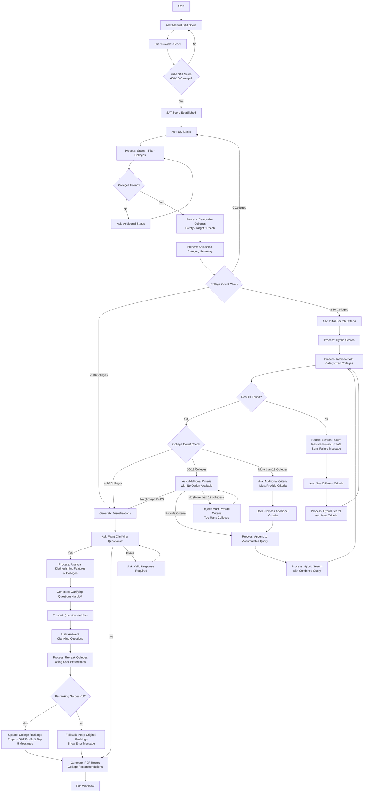

# College Chatbot 🎓🤖

An intelligent college admissions assistant that provides personalized college recommendations based on SAT scores, geographic preferences, and individual student needs.

## Overview

The College Chatbot is a Chainlit-powered web application that helps students navigate the college application process through an interactive, AI-driven workflow. It analyzes student profiles, categorizes colleges by admission probability, and provides detailed recommendations with downloadable reports.

### Key Features

- 🎯 **SAT-Based Matching**: Personalized recommendations using your SAT score (400-1600)
- 🗺️ **Geographic Filtering**: Filter colleges by preferred US states
- 📊 **Risk Categorization**: Automatic classification into Safety/Target/Reach schools
- 🔍 **Advanced Search**: Semantic search with natural language queries
- ❓ **Clarifying Questions**: AI-generated personalized preference discovery
- 📈 **Interactive Visualizations**: Comprehensive college analysis and comparisons
- 📄 **PDF Reports**: Downloadable college recommendation summaries

## How It Works

The chatbot follows a structured workflow to provide personalized college recommendations:

### Workflow Steps

1. **SAT Score Input** - Enter your SAT score for admission probability calculations
2. **Geographic Filtering** - Select preferred US states for college search
3. **College Categorization** - Automatic classification into Safety/Target/Reach schools
4. **Smart Search & Refinement** - Advanced filtering for large result sets
5. **Clarifying Questions** - Personalized preference analysis and re-ranking
6. **Final Recommendations** - Comprehensive analysis with visualizations and reports



## Quick Start with Docker

### Prerequisites

1. **Install Docker**
   - [Windows](https://docs.docker.com/desktop/install/windows-install/)
   - [macOS](https://docs.docker.com/desktop/install/mac-install/)
   - [Linux](https://docs.docker.com/engine/install/)

2. **Get OpenRouter API Key**
   - Sign up at [OpenRouter](https://openrouter.ai/)

### Deploy with Scripts

1. **Clone the repository:**
   ```bash
   git clone https://github.com/shermanpch/college-chatbot.git
   cd college-chatbot
   ```

2. **Set up environment:**
   ```bash
   cp example.env .env
   # Edit .env with your API key
   ```

3. **Deploy:**
   
   **Windows (PowerShell):**
   ```powershell
   .\deploy.ps1
   ```
   
   **macOS/Linux:**
   ```bash
   ./deploy.sh
   ```

4. **Access the application:**
   Open your browser to `http://localhost:8000`

### Manual Docker Deployment

If you prefer to run Docker commands manually:

```bash
# Build the image
docker build -t college-chatbot .

# Run the container
docker run -d -p 8000:8000 \
  -e OPENROUTER_API_KEY="your_api_key_here" \
  -e OPENROUTER_SELF_RETRIEVAL_MODEL="openai/gpt-4o-mini" \
  --name college-chatbot-container \
  college-chatbot
```

## Development Setup

### Local Development

1. **Clone and setup:**
   ```bash
   git clone https://github.com/shermanpch/college-chatbot.git
   cd college-chatbot
   python -m venv .venv
   source .venv/bin/activate  # On Windows: .venv\Scripts\activate
   pip install -r requirements.txt
   ```

2. **Configure environment:**
   ```bash
   cp example.env .env
   # Edit .env with your API keys
   ```

3. **Run locally:**
   ```bash
   chainlit run chatbot/app.py
   ```

### Code Quality & Linting

This project uses **ruff** for linting and formatting with **pre-commit** hooks:

**Install development dependencies:**
```bash
pip install -r requirements-dev.txt
pre-commit install
```

**Configuration:**
- Line length: 88 characters (Black standard)
- Auto-fix enabled for all fixable rules
- Python 3.10+ compatibility
- Automatic enforcement on commits

**Manual linting:**
```bash
# Run all pre-commit hooks
pre-commit run --all-files

# Run only ruff
ruff check .
ruff format .
```

## Project Structure

```
college-chatbot/
├── chatbot/                   # Main application code
│   ├── app.py                 # Chainlit application entry point
│   ├── components/            # Core chatbot components
│   ├── prompts/               # LLM prompts and templates
│   ├── utils/                 # Utility functions and helpers
│   └── workflow/              # Workflow management and state
├── data/                      # College data and documents
│   ├── chatbot/               # RAG documents and vector stores
│   └── external/              # External data sources
├── public/                    # Static assets (logos, CSS)
├── requirements.txt           # Python dependencies
├── Dockerfile                 # Docker configuration
├── deploy.sh / deploy.ps1     # Deployment scripts
└── README.md                  # This file
```

## Technology Stack

- **Framework**: [Chainlit](https://chainlit.io/) - Conversational AI interface
- **Workflow Engine**: [LangGraph](https://langchain-ai.github.io/langgraph/) - State-based workflow orchestration
- **Vector Database**: ChromaDB - College data retrieval
- **LLM**: OpenRouter API (GPT-4o-mini) - Natural language processing
- **Search**: Hybrid semantic + keyword search
- **Containerization**: Docker - Easy deployment
- **Code Quality**: Ruff + Pre-commit hooks

## Container Management

### Using Deployment Scripts

**Windows (PowerShell):**
```powershell
.\deploy.ps1           # Deploy
.\deploy.ps1 -Logs     # View logs
.\deploy.ps1 -Status   # Check status
.\deploy.ps1 -Stop     # Stop container
.\deploy.ps1 -Help     # See all options
```

**macOS/Linux:**
```bash
./deploy.sh           # Deploy
./deploy.sh --logs    # View logs
./deploy.sh --status  # Check status
./deploy.sh --stop    # Stop container
./deploy.sh --help    # See all options
```

### Manual Container Management

```bash
# View logs
docker logs college-chatbot-container

# Stop/start container
docker stop college-chatbot-container
docker start college-chatbot-container

# Remove container
docker stop college-chatbot-container
docker rm college-chatbot-container
```

## Configuration

### Environment Variables

Required environment variables (set in `.env` file):

```bash
OPENROUTER_API_KEY=your_api_key_here
OPENROUTER_SELF_RETRIEVAL_MODEL=openai/gpt-4o-mini
```

### Custom Configuration

- **Port**: Change port mapping in Docker run command
- **Model**: Modify `OPENROUTER_SELF_RETRIEVAL_MODEL` for different LLM
- **Data**: Replace college data in `data/chatbot/peterson_rag_documents/`

## Testing the Application

1. **Application Load Test**
   - Access `http://localhost:8000`
   - Verify Chainlit interface loads
   - Check College Chatbot branding

2. **Feature Testing**
   - SAT Score Input (400-1600 range)
   - State Selection for filtering
   - College categorization (Safety/Target/Reach)
   - Hybrid search functionality
   - Clarifying questions workflow
   - PDF report generation

3. **Monitor Logs**
   ```bash
   docker logs -f college-chatbot-container
   ```

## Troubleshooting

### Common Issues

**Container won't start:**
- Check `.env` file exists with required API keys
- Verify port 8000 is available
- Check Docker Desktop is running (Windows/macOS)

**Application not accessible:**
- Verify container is running: `docker ps`
- Check firewall settings
- Try `http://127.0.0.1:8000` instead of localhost

**Performance issues:**
- Monitor resources: `docker stats college-chatbot-container`
- Increase Docker memory allocation if needed

### Platform-Specific Notes

- **Windows**: Use PowerShell, ensure Docker Desktop is running
- **macOS**: Docker Desktop required, use Terminal
- **Linux**: Native Docker support, may need sudo permissions

## Contributing

1. Fork the repository
2. Create a feature branch
3. Install development dependencies: `pip install -r requirements-dev.txt`
4. Install pre-commit hooks: `pre-commit install`
5. Make your changes (linting runs automatically on commit)
6. Submit a pull request

## Security

- API keys are never committed to version control
- Application runs locally by default
- Environment variables are loaded from `.env` file
- Regular dependency updates recommended

## License

This project is open source. Please check the license file for details.

## Support

If you encounter issues:

1. Check container logs: `docker logs college-chatbot-container`
2. Verify prerequisites (Docker, API keys)
3. Review troubleshooting section
4. Open an issue on GitHub

---

**Pro Tip**: Have your SAT score ready and think about which US states you'd like to attend college in before starting! 🎓 