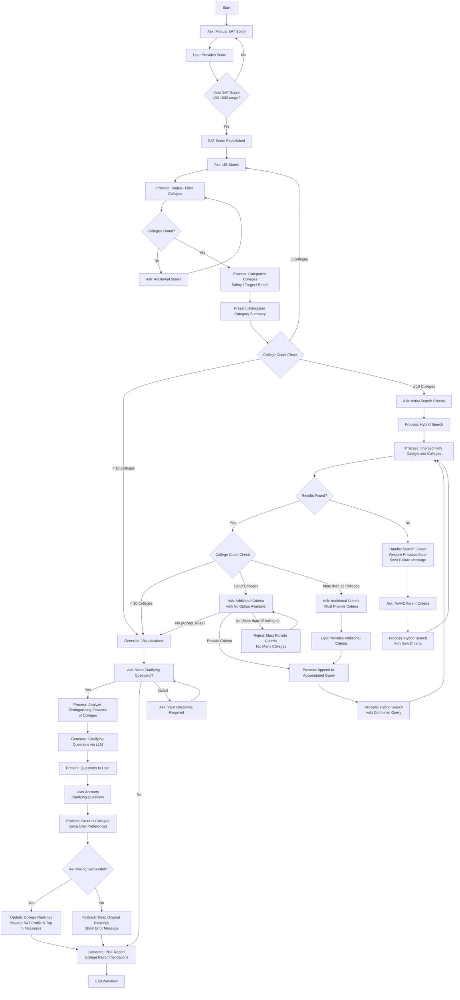

# College Chatbot 🎓🤖

An intelligent college admissions assistant that provides personalized college recommendations based on SAT scores, geographic preferences, and individual student needs.

## Overview

The College Chatbot is a Chainlit-powered web application that helps students navigate the college application process through an interactive, AI-driven workflow. It analyzes student profiles, categorizes colleges by admission probability, and provides detailed recommendations with downloadable reports.

### Key Features

- 🎯 **SAT-Based Matching**: Personalized recommendations using your SAT score (400-1600)
- 🗺️ **Geographic Filtering**: Filter colleges by preferred US states
- 📊 **Risk Categorization**: Automatic classification into Safety/Target/Reach schools
- 🔍 **Advanced Search**: Semantic search with natural language queries
- ❓ **Clarifying Questions**: AI-generated personalized preference discovery
- 📈 **Interactive Visualizations**: Comprehensive college analysis and comparisons
- 📄 **PDF Reports**: Downloadable college recommendation summaries

## Quick Start

### Prerequisites

1. **Install Docker**
   - [Windows](https://docs.docker.com/desktop/install/windows-install/)
   - [macOS](https://docs.docker.com/desktop/install/mac-install/)
   - [Linux](https://docs.docker.com/engine/install/)

2. **Get OpenRouter API Key**
   - Sign up at [OpenRouter](https://openrouter.ai/)

### Easy Deployment

1. **Clone the repository:**
   ```bash
   git clone https://github.com/shermanpch/college-chatbot.git
   cd college-chatbot
   ```

2. **Set up environment:**
   ```bash
   cp .env.example .env
   # Edit .env with your API key, model, and tunnel token:
   # OPENROUTER_API_KEY=your_api_key_here
   # OPENROUTER_SELF_RETRIEVAL_MODEL=openai/gpt-4o-mini
   # TUNNEL_TOKEN=your_tunnel_token_here
   ```

3. **Deploy:**
   ```bash
   ./deploy.sh
   ```
   This builds the app and starts both the chatbot and Cloudflare Tunnel containers.

4. **Access the application:**
   Via your configured domain (e.g., `https://college-coach.dev`), or uncomment `ports` in `docker-compose.yml` for local access at `http://localhost:8000`.

## Configuration

### Environment Variables

The application uses a `.env` file for configuration. Copy `example.env` to `.env` and configure:

**Required Variables:**
```bash
# OpenRouter API Configuration (Required)
OPENROUTER_API_KEY=your_openrouter_api_key_here
OPENROUTER_SELF_RETRIEVAL_MODEL=openai/gpt-4o-mini

# Cloudflare Tunnel (Required for production)
TUNNEL_TOKEN=your_tunnel_token_here
```

**Optional Configuration:**
```bash
# Additional models for specific components
OPENROUTER_MODEL=openai/gpt-4o-mini
OPENROUTER_RAGAS_MODEL=openai/gpt-4o-mini

# Application settings
PORT=8000
HOST=localhost
LOG_LEVEL=INFO

# External services (optional)
FIRECRAWL_API_KEY=your_firecrawl_api_key_here

# System settings (automatically set)
ANONYMIZED_TELEMETRY=False
TOKENIZERS_PARALLELISM=False
```

## Container Management

### Using Deployment Script

```bash
./deploy.sh                    # Build and start all services (app + tunnel)
./deploy.sh --logs             # View logs from all services
./deploy.sh --follow-logs      # Follow logs in real-time
./deploy.sh --status           # Check service status
./deploy.sh --stop             # Stop all services
./deploy.sh --down             # Stop and remove all containers
./deploy.sh --help             # See all options
```

### Manual Docker Compose Commands

```bash
# View logs
docker compose logs

# View logs for a specific service
docker compose logs cloudflared
docker compose logs app

# Stop/start services
docker compose stop
docker compose start

# Stop and remove containers
docker compose down
```

## Testing the Application

1. **Application Load Test**
   - Access `http://localhost:8000`
   - Verify Chainlit interface loads
   - Check College Chatbot branding

2. **Feature Testing**
   - SAT Score Input (400-1600 range)
   - State Selection for filtering
   - College categorization (Safety/Target/Reach)
   - Hybrid search functionality
   - Clarifying questions workflow
   - PDF report generation

3. **Monitor Logs**
   ```bash
   ./deploy.sh --follow-logs

   # Or using Docker Compose directly
   docker compose logs -f
   ```

## Development Setup

### Local Development (Alternative to Docker)

1. **Clone and setup:**
   ```bash
   git clone https://github.com/shermanpch/college-chatbot.git
   cd college-chatbot
   python -m venv .venv
   source .venv/bin/activate  # On Windows: .venv\Scripts\activate
   pip install -e .
   ```

2. **Configure environment:**
   ```bash
   cp example.env .env
   # Edit .env with your API key and model
   ```

3. **Run locally:**
   ```bash
   chainlit run chatbot/app.py
   ```

### Code Quality

**Install development tools:**
```bash
pip install -e ".[dev]"
pre-commit install
```

**Run linting:**
```bash
pre-commit run --all-files
```

## How It Works

The chatbot follows a structured workflow to provide personalized college recommendations:

### Workflow Steps

1. **SAT Score Input** - Enter your SAT score for admission probability calculations
2. **Geographic Filtering** - Select preferred US states for college search
3. **College Categorization** - Automatic classification into Safety/Target/Reach schools
4. **Smart Search & Refinement** - Advanced filtering for large result sets
5. **Clarifying Questions** - Personalized preference analysis and re-ranking
6. **Final Recommendations** - Comprehensive analysis with visualizations and reports

<details>
<summary>📊 Click to see detailed workflow diagram</summary>


```mermaid
graph TD
    A[Start] --> B[Ask: Manual SAT Score]
    B --> O[User Provides Score]
    O --> O1{Valid SAT Score<br/>400-1600 range?}
    O1 -- No --> B
    O1 -- Yes --> P[SAT Score Established]

    P --> Q[Ask: US States]
    Q --> R[Process: States - Filter Colleges]
    R --> S{Colleges Found?}
    S -- No --> T[Ask: Additional States]
    T --> R
    S -- Yes --> U[Process: Categorize Colleges<br/>Safety / Target / Reach]

    U --> V[Present: Admission Category Summary]
    V --> W{College Count Check}
    W -- "0 Colleges" --> Q
    W -- "< 10 Colleges" --> FIN[Generate: Visualizations]
    W -- "≥ 10 Colleges" --> Y[Ask: Initial Search Criteria]

    Y --> AA[Process: Hybrid Search]
    AA --> BB[Process: Intersect with Categorized Colleges]
    BB --> CC{Results Found?}

    CC -- Yes --> DD{College Count Check}
    DD -- "< 10 Colleges" --> FIN
    DD -- "10-12 Colleges" --> NN[Ask: Additional Criteria<br/>with No Option Available]
    DD -- "More than 12 Colleges" --> OO[Ask: Additional Criteria<br/>Must Provide Criteria]

    CC -- No --> SEARCH_FAIL[Handle: Search Failure<br/>Restore Previous State<br/>Send Failure Message]
    SEARCH_FAIL --> II[Ask: New/Different Criteria]
    II --> JJ[Process: Hybrid Search<br/>with New Criteria]
    JJ --> BB

    NN -- "No (Accept 10-12)" --> FIN
    NN -- "Provide Criteria" --> LL[Process: Append to Accumulated Query]
    NN -- "No (More than 12 colleges)" --> RRR[Reject: Must Provide Criteria<br/>Too Many Colleges]
    RRR --> NN

    OO --> KK[User Provides Additional Criteria]
    KK --> LL
    LL --> MM[Process: Hybrid Search<br/>with Combined Query]
    MM --> BB

    FIN --> Q_CLARIFY[Ask: Want Clarifying Questions?]
    Q_CLARIFY -- Yes --> TT[Process: Analyze Distinguishing Features<br/>of Colleges]
    Q_CLARIFY -- No --> PDF_GEN
    Q_CLARIFY -- Invalid --> Q_CLARIFY_RETRY[Ask: Valid Response Required]
    Q_CLARIFY_RETRY --> Q_CLARIFY

    TT --> UU[Generate: Clarifying Questions via LLM]
    UU --> VV[Present: Questions to User]
    VV --> WW[User Answers<br/>Clarifying Questions]
    WW --> XX[Process: Re-rank Colleges<br/>Using User Preferences]

    XX --> YY{Re-ranking Successful?}
    YY -- Yes --> ZZ[Update: College Rankings<br/>Prepare SAT Profile & Top 5 Messages]
    YY -- No --> AAA[Fallback: Keep Original Rankings<br/>Show Error Message]

    ZZ --> PDF_GEN[Generate: PDF Report<br/>College Recommendations]
    AAA --> PDF_GEN
    PDF_GEN --> E[End Workflow]
```

</details>

## Technology Stack

- **Framework**: [Chainlit](https://chainlit.io/) - Conversational AI interface
- **Workflow Engine**: [LangGraph](https://langchain-ai.github.io/langgraph/) - State-based workflow orchestration
- **Vector Database**: ChromaDB - College data retrieval
- **LLM**: OpenRouter API (GPT-4o-mini) - Natural language processing
- **Search**: Hybrid semantic + keyword search
- **Containerization**: Docker Compose - Multi-service deployment
- **Tunnel**: Cloudflare Tunnel - Secure public access
- **Code Quality**: Ruff + Pre-commit hooks

## Project Structure

```
college-chatbot/
├── chatbot/                   # Main application code
│   ├── app.py                 # Chainlit application entry point
│   ├── components/            # Core chatbot components
│   ├── prompts/               # LLM prompts and templates
│   ├── utils/                 # Utility functions and helpers
│   └── workflow/              # Workflow management and state
├── projectutils/              # Project utilities and configuration
├── data/                      # College data and documents
├── public/                    # Static assets (logos, CSS)
├── pyproject.toml             # Python project configuration and dependencies
├── requirements.txt           # Docker/deployment dependencies
├── docker-compose.yml         # Docker Compose orchestration (app + tunnel)
├── Dockerfile                 # App container configuration
├── deploy.sh                  # Deployment script
├── .env.example               # Environment template
└── README.md                  # This file
```

## Troubleshooting

### Common Issues

**Container won't start:**
- Check `.env` file exists with required API keys and `TUNNEL_TOKEN`
- Check Docker Desktop is running (Windows/macOS)
- Check logs: `docker compose logs`

**Tunnel not connecting:**
- Verify `TUNNEL_TOKEN` is set correctly in `.env`
- Check tunnel logs: `docker compose logs cloudflared`
- Ensure ingress rules in Cloudflare dashboard point to `http://app:8000`

**Application not accessible via domain:**
- Verify both containers are running: `docker compose ps`
- Check tunnel status in Cloudflare dashboard (Zero Trust > Tunnels)
- For local testing, uncomment `ports` in `docker-compose.yml` and access `http://localhost:8000`

**Performance issues:**
- Monitor resources: `docker stats`
- Increase Docker memory allocation if needed

## Advanced Topics

### Local Development Without Tunnel

To run only the app container with direct port access:

```bash
# Uncomment the ports block in docker-compose.yml, then:
docker compose up -d app
```

### Custom Configuration

- **Model**: Modify `OPENROUTER_SELF_RETRIEVAL_MODEL` for different LLM
- **Data**: Replace college data in `data/chatbot/peterson_rag_documents/`

## Contributing

1. Fork the repository
2. Create a feature branch
3. Install development dependencies: `pip install -e ".[dev]"`
4. Install pre-commit hooks: `pre-commit install`
5. Make your changes (linting runs automatically on commit)
6. Submit a pull request

## Security

- API keys are never committed to version control
- Environment variables are loaded from `.env` file
- Regular dependency updates recommended

## License

This project is open source. Please check the license file for details.

## Support

If you encounter issues:

1. Check logs: `docker compose logs`
2. Verify prerequisites (Docker, API keys, tunnel token)
3. Review troubleshooting section above
4. Open an issue on GitHub

---

**Pro Tip**: Have your SAT score ready and think about which US states you'd like to attend college in before starting! 🎓
