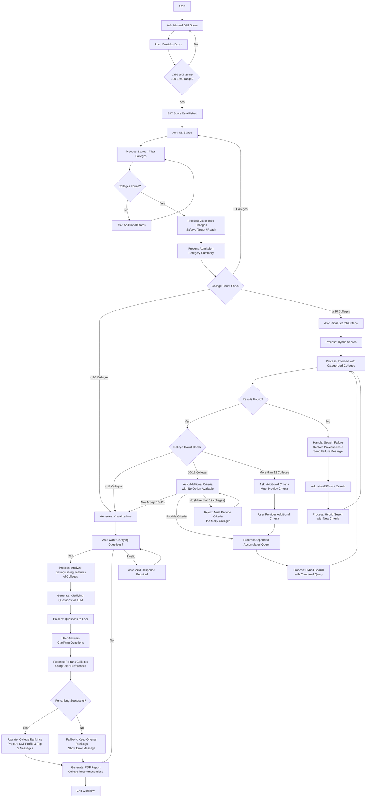

```mermaid
graph TD
    A[Start] --> B[Ask: Manual SAT Score]
    B --> O[User Provides Score]
    O --> O1{Valid SAT Score<br/>400-1600 range?}
    O1 -- No --> B
    O1 -- Yes --> P[SAT Score Established]

    P --> Q[Ask: US States]
    Q --> R[Process: States - Filter Colleges]
    R --> S{Colleges Found?}
    S -- No --> T[Ask: Additional States]
    T --> R
    S -- Yes --> U[Process: Categorize Colleges<br/>Safety / Target / Reach]

    U --> V[Present: Admission Category Summary]
    V --> W{College Count Check}
    W -- "0 Colleges" --> Q
    W -- "< 10 Colleges" --> FIN[Generate: Visualizations]
    W -- "≥ 10 Colleges" --> Y[Ask: Initial Search Criteria]

    Y --> AA[Process: Hybrid Search]
    AA --> BB[Process: Intersect with Categorized Colleges]
    BB --> CC{Results Found?}

    CC -- Yes --> DD{College Count Check}
    DD -- "< 10 Colleges" --> FIN
    DD -- "10-12 Colleges" --> NN[Ask: Additional Criteria<br/>with No Option Available]
    DD -- "More than 12 Colleges" --> OO[Ask: Additional Criteria<br/>Must Provide Criteria]

    CC -- No --> SEARCH_FAIL[Handle: Search Failure<br/>Restore Previous State<br/>Send Failure Message]
    SEARCH_FAIL --> II[Ask: New/Different Criteria]
    II --> JJ[Process: Hybrid Search<br/>with New Criteria]
    JJ --> BB

    NN -- "No (Accept 10-12)" --> FIN
    NN -- "Provide Criteria" --> LL[Process: Append to Accumulated Query]
    NN -- "No (More than 12 colleges)" --> RRR[Reject: Must Provide Criteria<br/>Too Many Colleges]
    RRR --> NN

    OO --> KK[User Provides Additional Criteria]
    KK --> LL
    LL --> MM[Process: Hybrid Search<br/>with Combined Query]
    MM --> BB

    FIN --> Q_CLARIFY[Ask: Want Clarifying Questions?]
    Q_CLARIFY -- Yes --> TT[Process: Analyze Distinguishing Features<br/>of Colleges]
    Q_CLARIFY -- No --> PDF_GEN
    Q_CLARIFY -- Invalid --> Q_CLARIFY_RETRY[Ask: Valid Response Required]
    Q_CLARIFY_RETRY --> Q_CLARIFY

    TT --> UU[Generate: Clarifying Questions via LLM]
    UU --> VV[Present: Questions to User]
    VV --> WW[User Answers<br/>Clarifying Questions]
    WW --> XX[Process: Re-rank Colleges<br/>Using User Preferences]

    XX --> YY{Re-ranking Successful?}
    YY -- Yes --> ZZ[Update: College Rankings<br/>Prepare SAT Profile & Top 5 Messages]
    YY -- No --> AAA[Fallback: Keep Original Rankings<br/>Show Error Message]

    ZZ --> PDF_GEN[Generate: PDF Report<br/>College Recommendations]
    AAA --> PDF_GEN
    PDF_GEN --> E[End Workflow]
```
